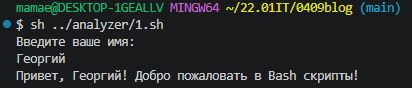
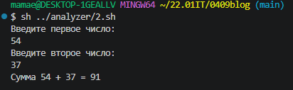
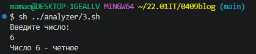
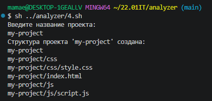
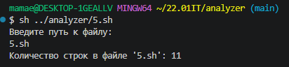
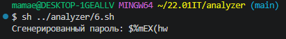
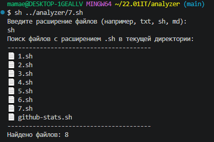
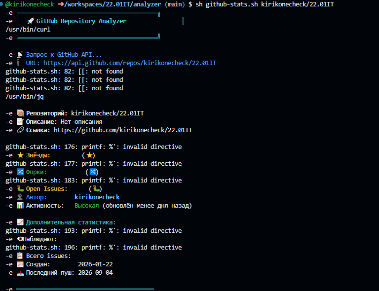

# Самостоятельная работа по Bash программированию

## 📋 Описание проекта

Этот репозиторий содержит решения заданий по Bash программированию. Все скрипты разработаны для выполнения в среде **Git-Bash** и протестированы в **Ubuntu WSL**.

## 🛠️ Требования

- Git Bash (Windows) или Bash (Linux/Mac)
- Git
- VSCode с расширением для Bash

Для скрипта `github-stats.sh` дополнительно требуются:
- `curl` - для запросов к GitHub API
- `jq` - для парсинга JSON ответов

Установка в Ubuntu/Debian:
```bash
sudo apt-get update
sudo apt-get install curl jq
```

### Структура проекта

```
bash-scripts/
├── 1.sh              # Приветствие пользователя
├── 2.sh              # Калькулятор суммы
├── 3.sh              # Проверка четности числа
├── 4.sh              # Создатель структуры проектов
├── 5.sh              # Счетчик строк в файле
├── 6.sh              # Генератор паролей
├── 7.sh              # Поиск файлов по расширению
├── github-stats.sh   # Анализ репозиториев GitHub
├── README.md         # Документация
└── .gitignore        # Игнорируемые файлы
```

### 🚀 Запуск скриптов

Все скрипты запускаются командой:

```bash
sh script_name.sh
```

Например:

```bash
sh 1.sh
sh github-stats.sh tensorflow/tensorflow
```

Дайте права на выполнение (опционально):

```bash
chmod +x *.sh
./1.sh
```

## 📝 Описание скриптов

### 1. Приветствие пользователя

Запрашивает имя пользователя и выводит персонализированное приветствие.

**Пример:**

```bash
$ sh 1.sh
Введите ваше имя:
Иван
Привет, Иван! Добро пожаловать в Bash скрипты!
```



### 2. Калькулятор суммы

Запрашивает два числа и выводит их сумму.

**Пример:**

```bash
$ sh 2.sh
Введите первое число:
15
Введите второе число:
27
Сумма 15 + 27 = 42
```



### 3. Проверка четности числа

Определяет, является ли число четным или нечетным.

**Пример:**

```bash
$ sh 3.sh
Введите число:
7
Число 7 - нечетное
```



### 4. Создатель структуры проектов

Создает структуру папок для веб-проекта.

**Пример:**

```bash
$ sh 4.sh
Введите название проекта:
my-project
Структура проекта 'my-project' создана:
my-project/
├── index.html
├── css/
│   └── style.css
└── js/
    └── script.js
```



### 5. Счетчик строк в файле

Подсчитывает количество строк в указанном файле.

**Пример:**

```bash
$ sh 5.sh
Введите путь к файлу:
script.sh
Количество строк в файле 'script.sh': 25
```



### 6. Генератор паролей

Генерирует случайный пароль длиной 8 символов.

**Пример:**

```bash
$ sh 6.sh
Сгенерированный пароль: aB3#xY9@
```



### 7. Поиск файлов по расширению

Ищет файлы по расширению в текущей директории.

**Пример:**

```bash
$ sh 7.sh
Введите расширение файлов (например, txt, sh, md):
sh
----------------------------------------
📄 1.sh
📄 2.sh
📄 3.sh
📄 4.sh
📄 5.sh
📄 6.sh
📄 7.sh
📄 github-stats.sh
----------------------------------------
Найдено файлов: 8
```



### 8. Анализ репозиториев GitHub

Анализирует популярные репозитории на GitHub с цветным выводом статистики.

**Пример:**

```bash
$ sh github-stats.sh tensorflow/tensorflow
╔════════════════════════════════════════╗
║  🚀 GitHub Repository Analyzer                ║
╚════════════════════════════════════════╝

📡 Запрос к GitHub API...
📦 Репозиторий: tensorflow/tensorflow
📝 Описание: An Open Source Machine Learning Framework for Everyone
⭐ Звёзды:       182,347  (⭐)
🔀 Форки:        73,891   (🔀)
🐛 Open Issues:  1,847    (🐛) ⚠️ Много открытых issues!
👤 Автор:        google
📊 Активность:   Высокая (обновлён 2 часа назад)

📈 Дополнительная статистика:
👁️ Наблюдают:     182,347
📋 Всего issues:  2,500
📊 % открытых:    74%
```

**🎨 Цветовое оформление в github-stats.sh**
```
⭐ Звёзды — жёлтым цветом

🔀 Форки — зелёным

🐛 Issues — красным (если > 100), иначе жёлтым

📦 Название — белым жирным

👤 Автор — голубым

📊 Активность — цвет зависит от времени последнего обновления
```

**🧪 Тестирование**
```
Все скрипты протестированы в:

Git Bash (Windows)

Ubuntu WSL

Bash (Linux)
```



## 📚 Полезные команды

```bash
# Проверка выполнения скрипта
sh script.sh

# Дать права на выполнение
chmod +x script.sh

# Посмотреть структуру проекта
tree

# Проверить статус Git репозитория
git status

# Добавить все файлы в коммит
git add .

# Создать коммит
git commit -m "Описание изменений"

# Отправить изменения в удаленный репозиторий
git push
```

**🤝 Вклад**

Если вы нашли ошибку или хотите предложить улучшение, создайте Issue или Pull Request.

**💡 Совет:** Всегда тестируйте скрипты перед отправкой в облако!

```

## .gitignore

```gitignore
# Игнорируем временные файлы
*.tmp
*.temp
*.log

# Игнорируем файлы проектов (созданные 4.sh)
my-project/
test-project/

# Игнорируем системные файлы
.DS_Store
Thumbs.db

# Игнорируем файлы IDE
.vscode/
.idea/
```

**Инструкция по использованию**

### Создайте репозиторий на **GitHub:**

```
Перейдите на github.com

Нажмите "New repository"

Назовите его, например, "bash-scripts"

Выберите "Public"

Нажмите "Create repository"
```

### Клонируйте репозиторий локально:

```bash
git clone https://github.com/ваш-username/bash-scripts.git
cd bash-scripts
```

### Создайте все файлы скриптов:

```
Скопируйте каждый скрипт в соответствующий файл (1.sh, 2.sh, и т.д.)

Не забудьте про README.md и .gitignore
```

### Дайте права на выполнение (Linux/Mac):
```bash
chmod +x *.sh
```

### Проверьте работу скриптов:

```bash
sh 1.sh
sh github-stats.sh tensorflow/tensorflow
```

### Отправьте изменения в GitHub:

```bash
git add .
git commit -m "Добавлены все Bash скрипты"
git push origin main
```